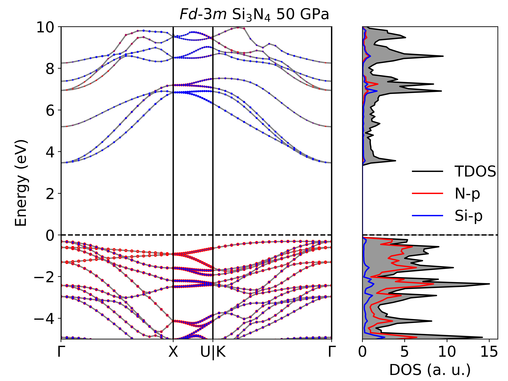

# bdkit


**bdkit** is a Python command-line tool that interfaces with [VASPkit](https://vaspkit.com/) to plot publication-quality projected band structures and density of states (BAND + DOS) from VASP calculations, for any number of elements and any combination of orbital projections (s, p, d, total).



## Features

- Combined band structure + DOS figure (2:1 layout) from VASPkit output files
- Orbital-projected "fat bands" (scatter size ∝ orbital contribution) for an arbitrary number of elements
- Projected DOS curves with cubic interpolation and filled total DOS
- Automatic formatting of high-symmetry k-point labels (Γ, Δ, Σ, subscripts...)
- Output in any Matplotlib format: `png` (default), `pdf`, `svg`, `eps`...
- **Editor-friendly SVG export**: lightweight vector files with named groups (`pband_K_p`, `pdos_N_s`, `TDOS_fill`, ...) that can be selected, moved and reordered individually in Inkscape or Illustrator, and text kept as real editable text

## Requirements

- [VASPkit](https://vaspkit.com/) to post-process the VASP calculations
- Python ≥ 3.8 with NumPy, SciPy, Pandas and Matplotlib:

```bash
pip3 install numpy pandas matplotlib scipy
```

## Installation

Download `bdkit` and `band_generic.py`, put them in the same directory, make `bdkit` executable and add it to your `PATH`:

```bash
git clone https://github.com/Sylvain-pitie/bdkit.git
cd bdkit
chmod +x bdkit
export PATH=$PATH:$(pwd)   # add this line to your ~/.bashrc to make it permanent
```

## Preparing the input files with VASPkit

Create a working directory (e.g. `band_dos`) containing two subdirectories, `band` and `dos`, and run the appropriate VASP calculations inside each one.

### Band structure

At the PBE level:

```bash
vaspkit -task 211 -file POSCAR
vaspkit -task 213 -file POSCAR
```

At the metaGGA or hybrid functional level:

```bash
vaspkit -task 303 -file POSCAR
vaspkit -task 252 -file POSCAR
vaspkit -task 254 -file POSCAR
```

### Density of states (all levels)

```bash
vaspkit -task 111 -file POSCAR
vaspkit -task 113 -file POSCAR
```

### Generated files

For a compound such as KN₈, VASPkit generates in `band/`:

```
BAND.dat    KLABELS    PBAND_K.dat    PBAND_N.dat
```

where `BAND.dat` contains the full band structure, `KLABELS` the high-symmetry k-point labels, and `PBAND_X.dat` the projection of element X onto the bands.

And in `dos/`:

```
TDOS.dat    PDOS_K.dat    PDOS_N.dat
```

where `TDOS.dat` contains the total DOS and `PDOS_X.dat` the projected DOS of element X.

## Usage

Run `bdkit` from the directory that contains the `band/` and `dos/` subdirectories:

```bash
bdkit kindatm typeatm typeorb colors [options]
```

### Positional arguments

| Argument  | Description | Example |
|-----------|-------------|---------|
| `kindatm` | Number of different elements in the compound | `2` |
| `typeatm` | Element names, comma-separated | `'K,N'` |
| `typeorb` | Orbitals to project for each element: orbitals comma-separated, elements separated by `;`. Allowed labels: `s`, `p`, `d`, `t` (total) | `'s,p;p'` |
| `colors`  | One color per orbital, same structure as `typeorb` | `'blue,red;green'` |

### Optional arguments

| Option | Default | Description |
|--------|---------|-------------|
| `-t`, `--title` | `""` | Title of the figure |
| `-lf`, `--labelfig` | `""` | Figure label (e.g. `'(a)'`) placed in the top-left corner |
| `-xl`, `--xlegend` | `1.1` | x position of the legend |
| `-yl`, `--ylegend` | `0.95` | y position of the legend |
| `-fsize`, `--fontsize` | `19` | Font size |
| `-xrot`, `--xrotation` | `0` | Rotation of the k-path labels |
| `-emin`, `--emin` | `-8.0` | Minimum energy (eV) |
| `-emax`, `--emax` | `6.0` | Maximum energy (eV) |
| `-dpi`, `--dpi` | `400` | Image resolution (raster formats only) |
| `-pformat`, `--pformat` | `png` | Output format: `png`, `pdf`, `svg`, `eps`... |
| `-seuil`, `--seuil` | `0.5` | Minimum scatter marker size to be drawn. Points with a near-zero orbital contribution are skipped, which drastically reduces SVG file size. Increase to `1`–`2` for even lighter files |
| `-ndos`, `--ndos` | `2000` | Number of interpolation points for the DOS curves. 2000 is visually indistinguishable from higher values and keeps vector files small |

### Examples

Plot the K(s,p) and N(p) projected bands and DOS of KN₈, as PNG:

```bash
bdkit 2 'K,N' 's,p;p' 'blue,red;green' -t 'KN8' -lf '(a)'
```

Same figure as an Inkscape-editable SVG, restricted to [-5, 5] eV:

```bash
bdkit 2 'K,N' 's,p;p' 'blue,red;green' -emin -5 -emax 5 -pformat svg
```

Total contribution per element (one color per element):

```bash
bdkit 2 'K,N' 't;t' 'blue;green' -pformat pdf
```

The output file is named `<elements>bandplot.<format>` (e.g. `KNbandplot.svg`).

## Editing the SVG output in Inkscape

When `-pformat svg` is used:

- Every family of objects is exported as a **named group**: `bandes_grises` (gray band lines), `pband_K_s`, `pband_N_p`, ... (projected band markers), `TDOS`, `TDOS_fill`, `pdos_K_s`, ... (DOS curves).
- Open the XML editor (`Ctrl+Shift+X`) or click an object and use *Object → Ungroup* to select a whole family at once, then move it or change its stacking order (`Page Up` / `Page Down`) when markers overlap.
- Text is exported as real text (`svg.fonttype = 'none'`), so labels remain fully editable.
- If the file is still too heavy for comfortable editing, increase `-seuil` and/or decrease `-ndos`.

## Troubleshooting

- **`FileNotFoundError: ./band/BAND.dat`** — run `bdkit` from the parent directory containing `band/` and `dos/`, not from inside them.
- **Mismatch errors at startup** — `kindatm`, the number of element names, the number of orbital lists and the number of color lists must all be consistent (and within each element, one color per orbital).
- **Old pandas versions** — bdkit uses `sep=r'\s+'` and is compatible with pandas 1.x, 2.x and 3.x.

## License

This project is licensed under the GNU General Public License v3.0 — see the [LICENSE](LICENSE) file for details.
